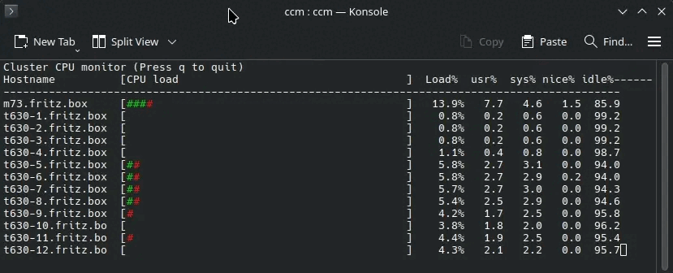

# Cluster CPU, Memory & Temperature monitor

Ncurses-based CLI tool that monitors CPU and memory usage, as well as CPU temperature across multiple hosts via SSH and displays real-time horizontal bar graphs:



## Supported Systems

`ccm` supports running on and monitoring both **Linux** and **FreeBSD** systems.

## Requirements

- GCC
- ncurses and pthreads libraries
- SSH access to target hosts with key-based authentication

## Build

```bash
make  # Linux
gmake # FreeBSD
```

## Installation

```bash
# Edit the example config and install it system-wide
edit ccm.conf.example
sudo cp ccm.conf.example /etc/ccm.conf

# Or copy it to your home directory for user-wide configuration
cp ccm.conf.example ~/.ccmrc
```

## Usage

1. Add hostnames to `hosts.txt` (one per line, `#` for comments)
2. If `hosts.txt` is not found, `~/.ccmrc` is checked
3. If neither exists, `/etc/ccm.conf` is used as fallback
4. Run: `./ccm` or `make run`
5. Press `q` or `ESC` to quit

### Command Line Options

```
./ccm [-n SEC] [--hostfile FILE] [-H HOSTS] [-t N] [-h] [-v]
```

- `-n SEC` - Update interval in seconds (default: 0.5)
- `--hostfile FILE` - Use specified hosts file (default: hosts.txt, fallback: ~/.ccmrc, then /etc/ccm.conf)
- `-H, --hosts LIST` - Comma-separated list of hosts to monitor
- `-t, --threads N` - Number of parallel SSH threads (default: 4)
- `-h, --help` - Show help message
- `-v, --version` - Show version information

### Examples

```bash
# Monitor hosts from file
./ccm --hostfile myhosts.txt

# Monitor specific hosts
./ccm -H "node1,node2,node3"

# Combine host file and command-line hosts
./ccm --hostfile hosts.txt -H "extra1,extra2"
```

## Hosts File Format

```
# Comments start with #
localhost
node1
node2
node3
```

## Author / Issues / Pull requests / License

 * Jakob Flierl - https://github.com/koppi - Initial release

This is an early release. The repository can be forked; issues and pull requests are welcome.

Licensed under [MIT](LICENSE).
